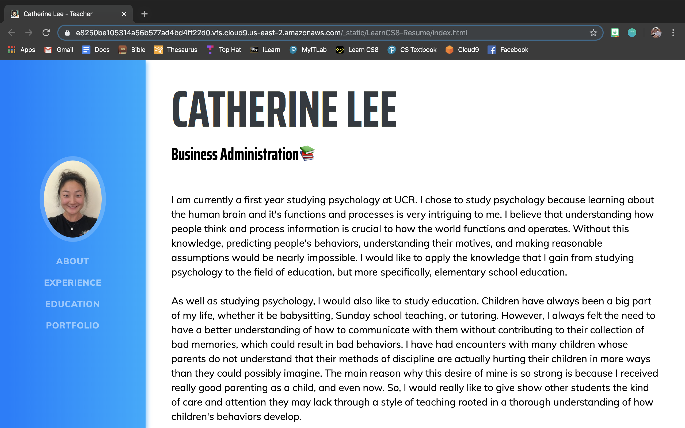

# Welcome to LearnCS8 Resume Website

This is an template website for you to fill in your own information. Follow the instructions at https://learncs8.com

Special thanks to the open source bootstrap libraries that made this website possible. 
<!DOCTYPE html>
<html>

<head>
  <meta charset="utf-8">
  <meta name="viewport" content="width=device-width, initial-scale=1.0">
  <title>markdown cs lab</title>
  <link rel="stylesheet" href="https://stackedit.io/style.css" />
</head>

<body class="stackedit">
  
<h1 id="catherine-lee---teaching">Catherine Lee - Teaching</h1>

<blockquote>

Written with <a href="https://stackedit.io/">StackEdit</a>.

</blockquote>

</body>

</html>
